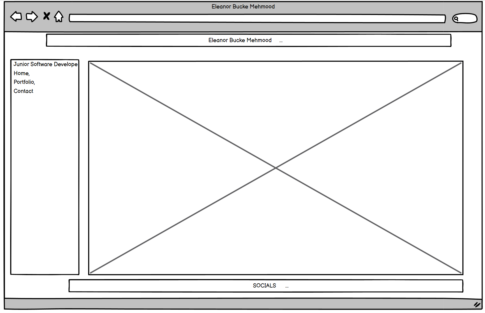

---

# My Portfolio #

This website was designed to showcase my portfolio, along with my experience.

---

**TABLE OF CONTENTS**
* [USER EXPERIENCE](#user-experience)
     * [Agile](#agile)
* [User Stories](#user-stories)
* [Features](#features)
* [Skeleton Plane](#skeleton-plane)
        * [Wireframes](#wireframes)
  
  ---

# User Experience

### Agile

I implemented agile methodology when creating this website. The link to the project board can be found [here](https://github.com/users/eleanorbucke21/projects/11).

### User Stories
* As a user I want to be able to tell what the website is about.
# Features 
## **SKELETON PLANE**
### **Wireframes**
The wireframes were created using [Balsamiq]([https://www.lucidchart.com/pages/templates/wireframe](https://balsamiq.com/wireframes/?gad=1&gclid=CjwKCAjwrranBhAEEiwAzbhNtZYfMOAiPj5cWhL0BQigVYN63_A7gFfis3aV6OcacliL5httuRHIdxoCxk0QAvD_BwE)https://balsamiq.com/wireframes/?gad=1&gclid=CjwKCAjwrranBhAEEiwAzbhNtZYfMOAiPj5cWhL0BQigVYN63_A7gFfis3aV6OcacliL5httuRHIdxoCxk0QAvD_BwE).

* Home Page
